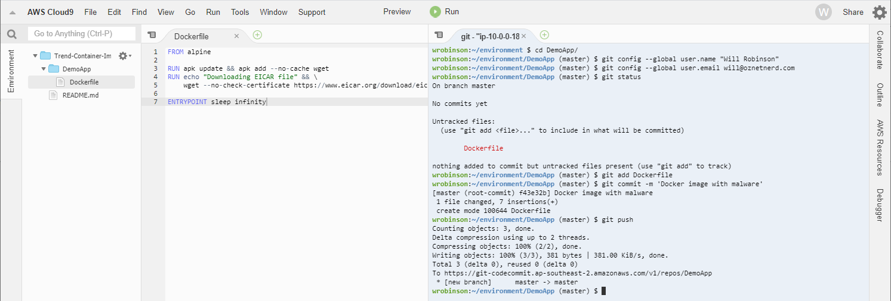
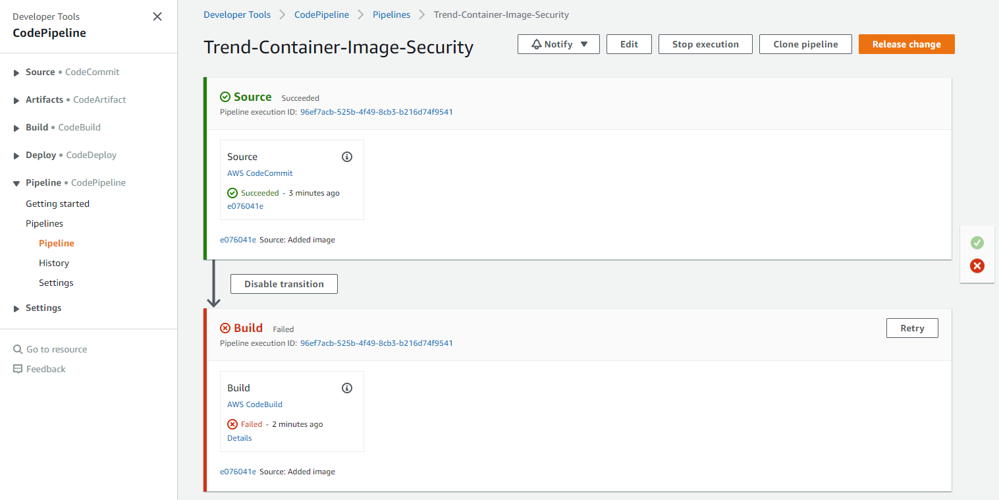

# Container Image Security Demo

A demo environment for Trend Micro's Cloud One: [Container Image Security solution](https://www.trendmicro.com/en_au/business/products/hybrid-cloud/cloud-one-container-image-security.html).

To emulate a real-world setup, the environment uses:
  * **EKS** (Runs Container Image Security)
  * **CodeCommit** (Version control for the Dockerfile)
  * **CodePipeline** (CI/CD pipeline to test the Dockerfile for secrets, malware & vulnerabilities)
  * **CodeBuild** (Builds the Docker image)
  * **ECR** (Registry to store clean Docker images)
  * **Secrets Manager** (stores the environment's passwords) 
  * **Cloud9** (Enables you to use the environment without having to install any dev tools)

## Account limits

**Note:** This solution uses [AWS' EKS Quick Start](https://github.com/aws-quickstart/quickstart-amazon-eks) CloudFormation template. This template creates a number of resources, including 3 EIPs.

As the default EIP limit is 5, it's likely you will hit this limit if you deploy this environment in an existing AWS account. This will result in the environment failing to create.

If you continue to encounter failures after having increased the EIP limit, it's likely you're encountering a different resource limitation. In that case, the following workaround is advised:

1. Create a new AWS account using AWS Organizations.
2. Increase the EIP limit to 10 or above.
3. Create a new user. Give it `Programmatic access`, `AWS Management Console access` and put it in the `Admins` group.
4. Create the environment by following the instructions below.
5. (Optional) If you want to use the Cloud9 IDE, log into AWS using the new account number and the user created above. 


## Deployment

1. Clone this repo:

```
git clone https://github.com/OzNetNerd/Cloud-One-Container-Image-Security-Demo.git
```

2. Install dependencies:

```
cd Cloud-One-Container-Image-Security-Demo
pip3 install -r requirements.txt --user
```

3. Change to the `code` directory, then execute `run.py` using parameters which suit your needs:

```
cd code
python3 run.py -h
usage: run.py [-h] -a ACTION -s STACK_NAME -f KEY_FILE [-k KEY_PAIR] [-p PASSWORD] [-u REGISTRY_USERNAME] [-e REGISTRY_PASSWORD] [-n NUMBER_OF_NODES] [-z NUMBER_OF_AZS] [-t NODE_INSTANCE_TYPE] [-i ADMIN_IP]

optional arguments:
  -h, --help            show this help message and exit
  -k KEY_PAIR, --key-pair KEY_PAIR
                        SSH key pair name in AWS
  -p PASSWORD, --password PASSWORD
                        Container Image Security console password
  -u REGISTRY_USERNAME, --registry-username REGISTRY_USERNAME
                        Pre-registry scanning username
  -e REGISTRY_PASSWORD, --registry-password REGISTRY_PASSWORD
                        Pre-registry scanning password
  -n NUMBER_OF_NODES, --number-of-nodes NUMBER_OF_NODES
                        Number of Kubernetes nodes
  -z NUMBER_OF_AZS, --number-of-azs NUMBER_OF_AZS
                        Number of Availability Zones
  -t NODE_INSTANCE_TYPE, --node-instance-type NODE_INSTANCE_TYPE
                        Node instance type
  -i ADMIN_IP, --admin-ip ADMIN_IP
                        Admin IP address

required arguments:
  -a ACTION, --action ACTION
                        "start" or "stop" the demo environment
  -s STACK_NAME, --stack-name STACK_NAME
                        Base name for the CloudFormation stacks
  -f KEY_FILE, --key-file KEY_FILE
                        Location of SSH key file on local system
```

For example:

```
$ cd code 
python3 run.py -a start -s TrendContainerSecurity -k DemoKey -f /home/wrobinson/.ssh/DemoKey.pem -p TrendDevOps
``` 

Once the above command is executed, the environment will commence building: 

```
Creating EKS stack. This will take 35 - 45 minutes
Waiting for "CisDemo-EKS" to create...
Done
Bastion IP: 13.210.26.34
Getting Bastion session...
Installing Container Image Security...
Waiting for Container Image Security hostname...
Found hostname: ab820bce8f35a48adb4d8d666d7bb277-1549086591.ap-southeast-2.elb.amazonaws.com
Downloading pre-registry scanning script...
Running script...
Getting pod status...
auth-865dd9d7d6-hmf29: 0/1 - Waiting for all pods to come up...
auth-865dd9d7d6-hmf29: 0/1 - Waiting for all pods to come up...
auth-865dd9d7d6-hmf29: 0/1 - Waiting for all pods to come up...
image-scan-57959bbbd4-k9v2h: 4/5 - Waiting for all pods to come up...
vulnerability-scan-547d8f75d6-f7pd2: 0/1 - Waiting for all pods to come up...
vulnerability-scan-547d8f75d6-f7pd2: 0/1 - Waiting for all pods to come up...
vulnerability-scan-547d8f75d6-f7pd2: 0/1 - Waiting for all pods to come up...
vulnerability-scan-547d8f75d6-f7pd2: 0/1 - Waiting for all pods to come up...
All Container Image Security pods are up:
NAME                                  READY   STATUS    RESTARTS   AGE
auth-865dd9d7d6-hmf29                 1/1     Running   0          87s
content-scan-5c9fff9fc-wnmtc          1/1     Running   0          87s
db-5f98b8c49c-cng7k                   1/1     Running   0          87s
docs-74999d5886-d4sfn                 1/1     Running   0          87s
frontend-587cf69c76-wzzf7             1/1     Running   0          87s
image-scan-57959bbbd4-k9v2h           5/5     Running   0          87s
license-6b7468ddbb-drd7f              1/1     Running   0          87s
malware-scan-6c646f488d-pnwnl         1/1     Running   0          87s
metrics-577df76f48-j2snq              1/1     Running   0          87s
proxy-59cfb48cc-tjz8g                 1/1     Running   0          62s
registry-75c9b56f79-sz9ql             3/3     Running   0          63s
registryviews-6fcfb67cd8-r5x6n        1/1     Running   0          86s
scan-69b9f8c6c-dr9cz                  1/1     Running   0          86s
vulnerability-scan-547d8f75d6-f7pd2   1/1     Running   0          87s
Creating CI/CD pipeline & Cloud9 stacks. This will take approximately 5 minutes
Waiting for "CisDemo-CICD" to create...
Done


Usage instructions:
1. Browse to the Container Image Security console: https://ab820bce8f35a48adb4d8d666d7bb277-1549086591.ap-southeast-2.elb.amazonaws.com
2. Log in with the username "administrator" and password "ContainerSec-3532713"
3. Change the password to "TrendDevOps"
4. (Optional): Log into the Cloud9 IDE: https://ap-southeast-2.console.aws.amazon.com/cloud9/ide/40b1d1ffacd4496fb8fa787f6268c16a
5. (Optional): Administer k8s cluster through the Bastion host: 13.210.26.34

Process finished with exit code 0
```

**Note:** As pipeline scanning is set up to use the provided password, the above steps **must** be done before proceeding.

## Scenario 1: Security in the CI/CD pipeline
### Overview

Container Image Security integrates into all CI/CD. By doing so, it's able to ensure that only secure images make it to the registry.

When an insecure image is created, Container Image Security will fail the pipeline. It will then produce a succinct report which provides information on the issue(s) which were found. 

### Guide

1. Log into Cloud9.

2. Create a file named `Dockerfile` within the `DemoApp` directory.

3. Paste the following text into the file. Doing so embeds fake malware into our Docker image:

```
FROM alpine

RUN apk update && apk add --no-cache wget
RUN echo "Downloading EICAR file" && \
    wget --no-check-certificate https://www.eicar.org/download/eicar.com.txt

ENTRYPOINT sleep infinity
```
 
4. Save the file.

5. Set up Git and `commit` the file:

```
cd DemoApp
git config --global user.name "John Doe"
git config --global user.email john@example.com
git add Dockerfile
git commit -m 'Docker image with malware'
git push
```

Example:



**Note:** Issuing the `commit` command automatically triggers your CI/CD pipeline. This results in:
    1. The Dockerfile being converted into a Docker image
    2. The Docker image being passed to Container Image Security
    3. The pipeline failing or succeeding
        * If Container Image Security finds an issue with the image, the pipeline fails. This prevents an insecure image from being used.
        * If Container Image Security does not find any issues, the image is pushed to ECR. This makes the image available for use. 

6. In the AWS console, look at the CodePipeline job:



We can see that the pipeline failed. Looking at the log, we can see it failed due to `Malware found: 1`:

```
{
    "id": "521ab11f-66a3-4685-b309-ebeec51f4154",
    "href": "/api/scans/521ab11f-66a3-4685-b309-ebeec51f4154",
    "name": "ab353b8cefca94179b457803e214fbdf-1594594088.ap-southeast-2.elb.amazonaws.com:5000/demoapp:latest",
    "source": {
        "registry": "ab353b8cefca94179b457803e214fbdf-1594594088.ap-southeast-2.elb.amazonaws.com:5000",
        "repository": "demoapp",
        "tag": "latest",
        "type": "docker",
        "insecureSkipVerify": true
    },
    "status": "completed-with-findings",
    "details": {
        "requested": "2020-06-12T04:44:16Z",
        "started": "2020-06-12T04:44:16Z",
        "updated": "2020-06-12T04:44:21Z",
        "completed": "2020-06-12T04:44:21Z",
        "digest": "sha256:c31e671df0df8d221110f7d60970c7386d23777319df5df62cd2105a8a03c02c",
        "os": "linux",
        "architecture": "amd64",
        "results": [
            {
                "id": "sha256:df20fa9351a15782c64e6dddb2d4a6f50bf6d3688060a34c4014b0d9a752eb4c",
                "createdBy": "/bin/sh -c #(nop) ADD file:c92c248239f8c7b9b3c067650954815f391b7bcb09023f984972c082ace2a8d0 in / ",
                "createdAt": "2020-05-29T21:19:46Z",
                "findings": {
                    "contents": {
                        "total": {},
                        "unresolved": {}
                    },
                    "vulnerabilities": {
                        "total": {},
                        "unresolved": {},
                        "fixAvailable": {}
                    }
                }
            },
            {
                "id": "sha256:eeb7cf6cef50e14a2a249d55cd8c6f1dc394c49b679623f62fb5f776049c6360",
                "createdBy": "/bin/sh -c apk update && apk add --no-cache wget",
                "createdAt": "2020-06-12T04:44:03Z",
                "findings": {
                    "contents": {
                        "total": {},
                        "unresolved": {}
                    },
                    "vulnerabilities": {
                        "total": {},
                        "unresolved": {},
                        "fixAvailable": {}
                    }
                }
            },
            {
                "id": "sha256:3e98a337f29466cca88d9ff36440eb454891cee45e9804a530b29aa2e689fa0a",
                "createdBy": "/bin/sh -c echo \"Downloading EICAR file\" &&     wget --no-check-certificate https://www.eicar.org/download/eicar.com.txt",
                "createdAt": "2020-06-12T04:44:05Z",
                "malware": "/api/scans/521ab11f-66a3-4685-b309-ebeec51f4154/layers/sha256:3e98a337f29466cca88d9ff36440eb454891cee45e9804a530b29aa2e689fa0a/malware",
                "findings": {
                    "malware": 1,
                    "contents": {
                        "total": {},
                        "unresolved": {}
                    },
                    "vulnerabilities": {
                        "total": {},
                        "unresolved": {},
                        "fixAvailable": {}
                    }
                }
            }
        ]
    },
    "findings": {
        "malware": 1,
        "contents": {
            "total": {},
            "unresolved": {}
        },
        "vulnerabilities": {
            "total": {},
            "unresolved": {},
            "fixAvailable": {}
        },
        "checklists": {
            "unresolved": {},
            "total": {}
        },
        "scanners": {
            "malware": {
                "status": "ok",
                "updated": "2020-05-26T15:15:00Z",
                "versions": {
                    "icrc": "1589100",
                    "trendX": "111200",
                    "blacklist": "25100"
                }
            },
            "vulnerabilities": {
                "status": "ok",
                "updated": "2020-06-03T04:22:46Z"
            },
            "vulnerabilityPatterns": {
                "status": "ok"
            }
        }
    }
}info: Malware found: 1
``` 

7. We can also review the results by logging into Container Image Security console:


8. Next let's see what happens when a clean image is put through the pipeline. Paste the below text into the `Dockerfile`:

```
FROM alpine

RUN apk update && apk add --no-cache wget


ENTRYPOINT sleep infinity
```

9. Save the changes and trigger the pipeline again:

```
git add Dockerfile
git commit -m 'Clean Docker image'
git push
```

10. Browsing to ECR shows that the image been uploaded and is ready for use:


## Scenario 2: Periodic registry scanning

Container Image Security scans your Docker registry every 24 hours. This provides two benefits:

1. Images which are not pushed through a CI/CD pipeline still get scanned

2. When a new vulnerability is discovered in an existing image, users are notified within 24 hours

### Guide

1. Log into Cloud9. 

2. Issue the following command:

```
aws ecr get-login-password | docker login --username AWS --password-stdin https://<YOUR_ACCOUNT_NUMBER>.dkr.ecr.<YOUR_REGION>.amazonaws.com
```

4. Run the following commands: 

```
aws ecr create-repository --repository-name oznetnerd/cve-2018-11776-struts2
docker pull oznetnerd/cve-2018-11776-struts2
docker tag oznetnerd/cve-2018-11776-struts2 <YOUR_AWS_ACCOUNT_NUMBER>.dkr.ecr.<YOUR_REGION>.amazonaws.com/oznetnerd/cve-2018-11776-struts2
docker push <YOUR_AWS_ACCOUNT_NUMBER>.dkr.ecr.<YOUR_REGION>.amazonaws.com/oznetnerd/cve-2018-11776-struts2
```

5. Log into Container Image security.

6. Click "Registries", then "Create".

7. Fill in the following information:
  * **Name:** AWS Reg 
  * **Connection Details:** Amazon Elastic Container Registry
  * **Region**: <YOUR_REGION>
  * **Authentication Method**: Instance Role
  * Enable **Start scan when registry is created**

8. Click "Create".

9. Click "Scans" and "Dashboard" to review the results. 


## Clean up

To destroy the environment, specify `-a stop` like so:

```
python3 -a stop -s TrendContainerDemo -f /home/wrobinson/.ssh/DemoKey.pem
```

# Contact

* Blog: [oznetnerd.com](https://oznetnerd.com)
* Email: will@oznetnerd.com